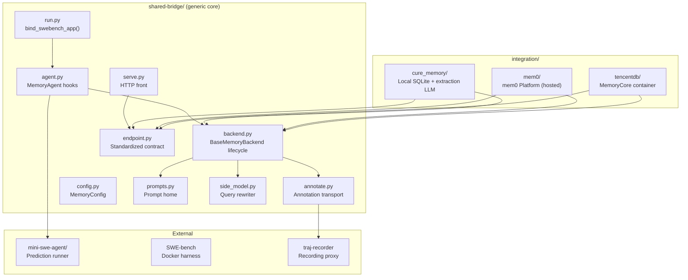
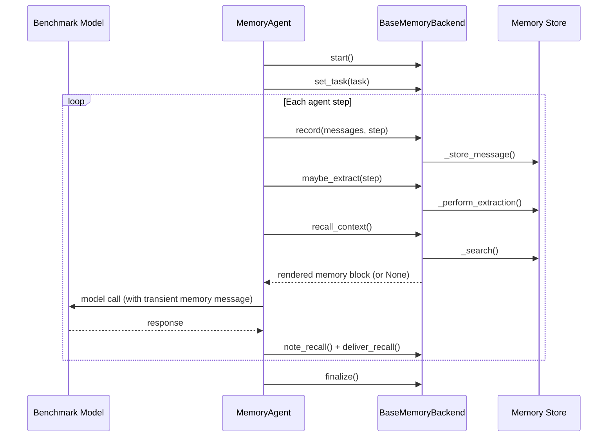

# Architecture

memory-bridge uses a layered architecture: an agent-agnostic memory core (backend lifecycle, endpoint contract, integrations), a thin agent adapter currently targeting mini-swe-agent, and the SWE-bench evaluation harness that drives A/B comparisons.

## Component overview



## Directory layout

```text
memory-bridge/
├── shared-bridge/     GENERIC bridge core (names no integration; test-enforced)
│   ├── agent.py       MemoryAgent: hooks memory into the agent loop
│   ├── backend.py     BaseMemoryBackend: lifecycle skeleton + tracing + cache + rewrite
│   ├── side_model.py  Fixed-format side-model calls (query rewriter)
│   ├── prompts.py     Prompt home: recall policy, extraction guidelines, rewrite prompt
│   ├── config.py      MemoryConfig: all shared config keys (extra="forbid")
│   ├── endpoint.py    Standardized add/search/update/delete contract
│   ├── serve.py       Stdlib HTTP front for any MemoryEndpoint
│   ├── annotate.py    Annotation transport to the traj-recorder proxy
│   └── run.py         bind_swebench_app(): rebind the runner's agent class
├── integration/       One package per memory system, bound to shared-bridge
│   ├── cure_memory/   Local SQLite store + separate extraction LLM
│   ├── mem0/          mem0 Platform (hosted extraction, httpx REST client)
│   └── tencentdb/     TencentDB-Agent-Memory (MemoryCore container per run root)
├── utils/             Pipeline scripts (setup → predict → merge → evaluate → summarize)
├── mini-swe-agent/    Prediction runner checkout (keeps its own tooling venv)
└── output/            Run roots
```

## The shared environment

The bundle uses exactly one environment: the uv workspace rooted at the bundle directory.


Never drop the `litellm[proxy]` dependency — without it, the first model call fails with `ModuleNotFoundError: No module named 'fastapi'`.


* `shared-bridge` and all three integrations are **editable workspace members**
* `mini-swe-agent` is an editable path dependency and `litellm[proxy]` a regular dependency; neither is a workspace member
* Integrations never carry their own uv environment
* The memory arm and the merge/summary phases run through `uv run --project <bundle-root> ...`; baseline predictions keep mini-swe-agent's own env (with a `litellm[proxy]` overlay), and evaluation runs through the SWE-bench checkout

## How memory enters the episode

The benchmark model sees only the stock `bash` tool — no memory tools, no prompt nudges, no model subclass. Memory enters the episode as a **transient** user message injected before a model call (reaches the model but is never persisted to the trajectory), and leaves it as recorded messages that the host-side backend later extracts into the store.



## Query rewriter and search cache

Two mechanisms reduce wasted work and improve recall relevance:


{% column width="50%" %}
### Dirty-flag search cache

The search runs only when a new episode begins, an extraction tick was counted (success or failure — a failed extraction may still have written), or the recall query was rewritten. Clean steps reuse the memoized payload, eliminating redundant hosted-search calls.

A failed search is never cached — the flag stays set so the next step retries.


{% column width="50%" %}
### Query rewriter

When `rewrite_every_n_steps > 0`, a side-model rewrites the recall query at the configured cadence. The rewriter receives the task text and recent progress (last 6 recorded messages), and returns a focused search query (≤300 characters).

The rewrite call is fail-closed: any error keeps the previous query.



## SWE-bench evaluation arms

An A/B comparison consists of exactly two runs over the same ordered instance list:

| Arm | Driver | Memory | Trajectory |
|---|---|---|---|
| **Baseline** | `utils/run-predictions.sh` | None | Byte-identical to unmodified runner |
| **Memory** | `utils/run-memory-arm.sh <integration>` | Enabled (`scope=run`) | Annotated with `memory_*` events |

Both arms write into separate run roots and are graded by the same Docker harness, so the score difference is attributable to the memory system alone.

## Companion checkouts

| Repository | Location | Purpose |
|---|---|---|
| [mini-swe-agent](https://github.com/SWE-agent/mini-swe-agent) | `mini-swe-agent/` (inside repo) | Prediction runner; editable path dependency (not a workspace member) |
| [SWE-bench](https://github.com/SWE-bench/SWE-bench) | Sibling or `SWE-bench/` | Local Docker evaluation harness |
| [traj-recorder](https://github.com/ChangranXU/traj-recorder/tree/memory) | `extension/traj-recorder/` (inside the repo or beside it) | Recording proxy with roster lanes and annotate endpoint |
