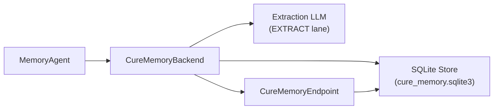

# CURE Memory

The CURE integration (`integration/cure_memory/`) uses a local SQLite store for memory persistence and a dedicated extraction LLM for converting agent messages into structured memories.

## Architecture

## Components

| Component | Module | Purpose |
|---|---|---|
| Backend | `cure_memory_bridge.backend` | Implements `BaseMemoryBackend` lifecycle hooks |
| Agent | `cure_memory_bridge.agent` | Binds the backend to `MemoryAgent` |
| Endpoint | `cure_memory_bridge.endpoint` | `CureMemoryEndpoint` adapter |
| Memory system | `cure_memory.*` | The embedded CURE memory system |

## Configuration

Beyond the shared `MemoryConfig` keys, the CURE integration adds extraction client settings — environment variables, each with an `agent.memory.extract_*` config-field equivalent that takes precedence over the environment variable:

| Environment variable | Config field | Description |
|---|---|---|
| `EXTRACT_MODEL` | `agent.memory.extract_model` | Model name for the extraction LLM |
| `EXTRACT_BASE_URL` | `agent.memory.extract_base_url` | API endpoint for the extraction LLM |
| `EXTRACT_API_KEY` | `agent.memory.extract_api_key` | API key for the extraction LLM |

The memory-arm driver wires all three per instance through the EXTRACT proxy lane, so the roster `.env` needs none of them for the arm flow.


The bundle's CURE copy (`integration/cure_memory/src/cure_memory`) is the hardened source of truth — it removed upstream credential-leak defaults (the hardcoded third-party endpoint fallback and the `$OPENAI_API_KEY` env fallback). **Never** bulk-refresh the copy from upstream.


## Run isolation

With `scope=run`, the CURE arm creates a shared SQLite store at `runs/mini-swe-agent/cure_memory.sqlite3` in the run root. The store uses a two-layer applicability lattice:

* **Repo-bound memories** (`scope="project"`) — retrievable only inside episodes of the same repository
* **General memories** (`scope="user"`, `project_id=NULL`) — flow to every episode

## Proxy lanes

| Lane | Role | Traffic |
|---|---|---|
| MAIN | Benchmark model | Every model call |
| EXTRACT | Extraction LLM | Memory extraction decisions |
| QUERY | Query rewriter | Recall query rewrites (when enabled) |

## Memory identity

Scheme: `cure-sqlite-row-version-v1`

Format: `store_id:semantic_digest` — stable across the episode lifecycle and joinable to deliveries in later episodes.

## Extraction guidelines

The CURE backend conveys `extraction_guidelines` by appending the text into its `MEMORY_POLICY_PROMPT` (`cure_memory/prompts.py:memory_policy_prompt`). The capability flag `_CONVEYS_EXTRACTION_GUIDELINES = True` is declared on the backend.

## Compared with the native approach

Natively, CURE is a library: the host application calls `start_session` / `record_message` / `extract_runtime_memories` / `memory_search` itself and decides when each happens. The integration drives the same memory system through the shared backend lifecycle, so the arm scores CURE itself — every action uses the native calls, and the bridge's automation is applied uniformly across integrations.

| Memory action | Native | This integration | Aligned? |
|---|---|---|---|
| Add / extract | Host records messages and calls extraction manually | Same `record` / `extract` calls, driven by the backend's extraction ticks | ✅ |
| Search / recall | Host calls `memory_search` and places the context itself | Same native search, run each step under the shared injection policy | ✅ |
| Update / delete | Extraction LLM decides supersede/delete actions | Same in-arm behavior; the endpoint additionally exposes update/delete externally | ✅ |

All three actions use the same native CURE calls. The only differences are in automation: extraction timing is driven by a shared cadence (identical across integrations, keeping extraction effort comparable), and recall is wrapped in the shared injection policy (score floor, character budgets). The standardized endpoint is additive — it never touches the arm's measured behavior.
