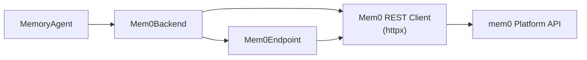

# mem0 Platform

The mem0 integration (`integration/mem0/`) uses the [mem0 Platform](https://mem0.ai) for hosted memory storage and extraction, calling its REST API directly over `httpx`.

## Architecture

## Components

| Component | Module | Purpose |
|---|---|---|
| REST client | `mem0_bridge.client` | httpx-based client for the mem0 Platform API (v3 add/search/get-all; v1 single-memory CRUD, ping, and event poll) |
| Backend | `mem0_bridge.backend` | Implements `BaseMemoryBackend` lifecycle hooks |
| Agent | `mem0_bridge.agent` | Binds the backend to `MemoryAgent` |
| Endpoint | `mem0_bridge.endpoint` | `Mem0Endpoint` adapter |

## Configuration

| Variable | Location | Description |
|---|---|---|
| `MEM0_API_KEY` | `integration/mem0/.env` | Platform API key (required) |

## Run isolation

Run isolation comes from a **per-run user ID** minted from the timestamped run-root name. All memories for a run are scoped to this user ID on the platform.

## Proxy lanes

| Lane | Role | Traffic |
|---|---|---|
| MAIN | Benchmark model | Every model call |
| MEMORY | Annotation namespace | Zero model calls — the bridge posts memory protocol events from platform receipts |
| QUERY | Query rewriter | Recall query rewrites (when enabled) |

## Memory identity

The mem0 integration uses the platform's own memory ID, which is stable across `UPDATE` versions.

## Extraction guidelines

The mem0 backend conveys `extraction_guidelines` as the add endpoint's advisory per-request `custom_instructions`. The capability flag `_CONVEYS_EXTRACTION_GUIDELINES = True` is declared on the backend.

## Platform API mapping

| Endpoint action | mem0 Platform API |
|---|---|
| Add | `POST /v3/memories/add/` with messages payload (async — the client polls `GET /v1/event/{id}/` until the add persists) |
| Search | `POST /v3/memories/search/` with `query` + `filters.user_id` (+ `top_k`, `threshold`) |
| Update | `PUT /v1/memories/{id}/` with `{text, metadata}` |
| Delete | `DELETE /v1/memories/{id}/` |

## Scope limitation


The hosted platform carries no bridge-side scope — there is no equivalent of CURE's two-layer repo/general lattice. All memories are user-wide. Optional per-repo scoping via metadata filters is a future roadmap item.


## Compared with the native approach

Natively, the mem0 Platform is used through the `mem0ai` SDK's `MemoryClient` (`add` / `search` / `update` / `delete`) against the hosted API. The integration performs the same four actions over raw REST against the same platform, so the arm scores the platform itself.

| Memory action | Native | This integration | Aligned? |
|---|---|---|---|
| Add | SDK `add(...)` (async, caller may poll) | Same v3 add; client polls until persisted | ✅ |
| Extract | Hosted platform-side (`infer=true`) | Same hosted extraction; guidelines via `custom_instructions` | ✅ |
| Search | SDK `search(query, filters=...)` with server-default thresholds | Same v3 search; `threshold` always sent explicitly | ✅ |
| Update / delete | SDK v1 `update` / `delete` | Same v1 calls, 1:1 | ✅ |

All four actions hit the same platform endpoints as the native SDK. Two knobs are pinned explicitly rather than left to server defaults:

- **Add attribution**: the contract returns success only after persistence, and assistant facts are attributed to `user_id` (not `agent_id`) so user-filtered searches find them.
- **Search threshold**: `threshold` is always sent explicitly because server defaults can drift between API versions (silent relevance cutoffs). Rerank, graph memory, and v2 filter operators are left off so that arm and endpoint share exactly one retrieval semantics.

The endpoint's `user_id` ownership read on update/delete is endpoint-only and never runs in the arm.
