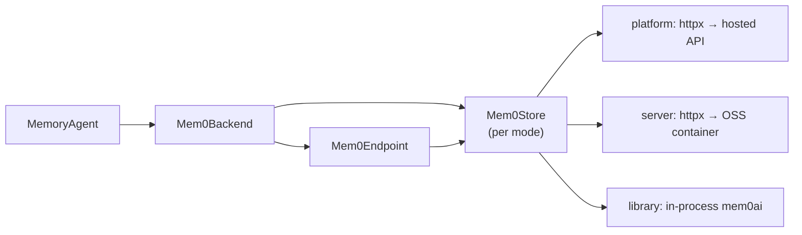

# mem0

The mem0 integration (`integration/mem0/`) runs [mem0](https://mem0.ai) in one of three deployment modes, selected by the anchored `mode:` line in `integration/mem0/configs/memory_defaults.yaml`. The mode is yaml-owned: the memory-arm driver reads the same line (`read_mem0_mode`) and refuses `--config agent.memory.mode=` extras, so driver and bridge can never diverge.

| Mode | Talks to | Extraction runs | Prerequisites |
|---|---|---|---|
| `platform` (default) | The hosted [mem0 Platform](https://mem0.ai) REST API over httpx | Hosted, platform-side | `MEM0_API_KEY` in the bundle-root `.env` |
| `server` | A per-run self-hosted OSS server container over httpx | Inside the container, against the provider upstream | Docker running; the full `EMBEDDING_*` quartet in the bundle-root `.env` (fail-closed) |
| `library` | The in-process `mem0ai` engine | In-process, against the provider upstream | The opt-in `mem0-library` dependency group; the `EMBEDDING_*` quartet |

Extraction traffic is never recorded in the trajectory in any mode — the MEMORY proxy lane stays a zero-model-call annotation namespace.

## Architecture

## Components

| Component | Module | Purpose |
|---|---|---|
| Store layer | `mem0_bridge.stores` | `Mem0Store` protocol + `open_store(mode, settings)` factory with lazy per-mode imports; one store per mode (`platform.py`, `server.py`, `library.py`), consumed by both the backend and the endpoint |
| Platform REST client | `mem0_bridge.client` | httpx-based client for the hosted API (v3 add/search/get-all; v1 single-memory CRUD, ping, and event poll) — wrapped by the platform store |
| Backend | `mem0_bridge.backend` | Implements `BaseMemoryBackend` lifecycle hooks |
| Agent | `mem0_bridge.agent` | Binds the backend to `MemoryAgent` |
| Endpoint | `mem0_bridge.endpoint` | `Mem0Endpoint` adapter |

## Server mode

The driver manages a two-container stack per run root on one bridge network: `pgvector/pgvector:pg17` (no published port) plus the API server built at runtime from the vendored clone (`integration/mem0/vendor/mem0/`, routes pin `fdfb763`) with the engine pinned to `mem0ai==2.0.19`. The API is published at `127.0.0.1:8890` — a machine-wide single-arm claim makes a concurrent server arm fail loudly. The store lives on run-root volumes under `<run-root>/mem0-server/`; containers and the network are removed on exit.

Two fail-fatal guards run before the arm: the driver precreates the `memories` table at `vector($EMBEDDING_DIMENSIONS)` (the server's default config has no dims channel — its eager collection create would birth the collection at the 1536 default, and a dims mismatch makes adds return ADD receipts while persisting nothing), then runs a canary self-check (one verbatim add + search + delete under a scratch user id).

## Library mode

The engine runs inside the bridge process (`from mem0 import Memory`), with its store under `<run-root>/mem0/` (qdrant + history db) via `agent.memory.run_root`. The `mem0ai` SDK enters the shared env only through the opt-in `mem0-library` dependency group — every library-mode instance invocation carries `uv run --group mem0-library`; a plain `uv sync` evicts it. `search_timeout` is ignored in this mode (in-process; the shared stance bounds network calls only).

## Configuration

| Variable | Location | Description |
|---|---|---|
| `MEM0_API_KEY` | bundle-root `.env` | Platform API key (platform mode only) |
| `EMBEDDING_MODEL` / `EMBEDDING_API_KEY` / `EMBEDDING_BASE_URL` / `EMBEDDING_DIMENSIONS` | bundle-root `.env` | Embedding quartet — required (fail-closed) in server/library modes: the OSS engine embeds on every add and search with no lexical fallback. Unused in platform mode. |

## Run isolation

Run isolation comes from a **per-run user ID** minted from the timestamped run-root name. All memories for a run are scoped to this user ID; the server/library modes add fresh per-run stores on top.

## Proxy lanes

| Lane | Role | Traffic |
|---|---|---|
| MAIN | Benchmark model | Every model call |
| MEMORY | Annotation namespace | Zero model calls — the bridge posts memory protocol events from the engine's receipts |
| QUERY | Query rewriter | Recall query rewrites (when enabled) |

## Memory identity

The mem0 integration uses the engine's own memory ID, which is stable across `UPDATE` versions. The trace identity scheme records the mode (`mem0-<mode>-memory-v1`).

## Extraction guidelines

The mem0 backend conveys `extraction_guidelines` as the add call's advisory instructions — `custom_instructions` on the platform, `prompt` on the OSS surfaces (verified to land in the same advisory slot). The capability flag `_CONVEYS_EXTRACTION_GUIDELINES = True` is declared on the backend.

## Platform API mapping

The platform-mode surface:

| Endpoint action | mem0 Platform API |
|---|---|
| Add | `POST /v3/memories/add/` with messages payload (async — the client polls `GET /v1/event/{id}/` until the add persists) |
| Search | `POST /v3/memories/search/` with `query` + `filters.user_id` (+ `top_k`, `threshold`) |
| Update | `PUT /v1/memories/{id}/` with `{text, metadata}` |
| Delete | `DELETE /v1/memories/{id}/` |

## Scope limitation


mem0 carries no bridge-side scope in any mode — there is no equivalent of CURE's two-layer repo/general lattice. All memories are user-wide. Optional per-repo scoping via metadata filters is a future roadmap item.


## Compared with the native approach

Natively, the mem0 Platform is used through the `mem0ai` SDK's `MemoryClient` (`add` / `search` / `update` / `delete`) against the hosted API. In platform mode the integration performs the same four actions over raw REST against the same platform, so the arm scores the platform itself. (Library mode runs the native `mem0ai` engine itself; the comparison below describes platform mode.)

| Memory action | Native | This integration | Aligned? |
|---|---|---|---|
| Add | SDK `add(...)` (async, caller may poll) | Same v3 add; client polls until persisted | ✅ |
| Extract | Hosted platform-side (`infer=true`) | Same hosted extraction; guidelines via `custom_instructions` | ✅ |
| Search | SDK `search(query, filters=...)` with server-default thresholds | Same v3 search; `threshold` always sent explicitly | ✅ |
| Update / delete | SDK v1 `update` / `delete` | Same v1 calls, 1:1 | ✅ |

All four actions hit the same platform endpoints as the native SDK. Two knobs are pinned explicitly rather than left to server defaults:

- **Add attribution**: the contract returns success only after persistence, and assistant facts are attributed to `user_id` (not `agent_id`) so user-filtered searches find them.
- **Search threshold**: `threshold` is always sent explicitly because server defaults can drift between API versions (silent relevance cutoffs). Rerank, graph memory, and v2 filter operators are left off so that arm and endpoint share exactly one retrieval semantics.

The endpoint's `user_id` ownership read on update/delete is endpoint-only and never runs in the arm.
