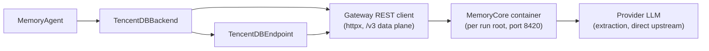

# TencentDB Agent Memory

The tencentdb integration (`integration/tencentdb/`) runs the standalone **MemoryCore** gateway of [TencentDB-Agent-Memory](https://github.com/TencentCloud/TencentDB-Agent-Memory) as one Docker container per run root (SQLite + FTS5; zero external services besides an OpenAI-compatible extraction LLM). The bridge talks to its REST API directly over `httpx`.

## Architecture

## Components

| Component | Module | Purpose |
|---|---|---|
| REST client | `tencentdb_bridge.client` | httpx client for the `/v3` data plane (+ the one `/v2/pipeline/status` drain poll) |
| Backend | `tencentdb_bridge.backend` | Implements `BaseMemoryBackend` lifecycle hooks; layered recall surface (L1 facts, L3 persona, L2 index) + the on-demand L0 conversation-search guide |
| Agent | `tencentdb_bridge.agent` | Binds the backend to `MemoryAgent` |
| Endpoint | `tencentdb_bridge.endpoint` | `TencentDBEndpoint` adapter |

## Deployment

One container per run root, driver-managed by `run-memory-arm.sh tencentdb`: a credential-free gateway yaml at `<run-root>/tdai/tdai-gateway.yaml` (secrets interpolate from `docker run -e` env), data volume at `<run-root>/tdai/data`, port published on `127.0.0.1:8420` only. Teardown is a plain `docker rm -f`.

The pinned image is `agentmemory/memory-core:1.0.1-beta.1`. The vendored upstream clone (`src/TencentDB-Agent-Memory/`, gitignored) is the API reference and the fallback-build anchor.

The optional embedding lane needs **all four** roster `.env` keys — `EMBEDDING_MODEL`, `EMBEDDING_API_KEY`, `EMBEDDING_BASE_URL`, `EMBEDDING_DIMENSIONS` — or none (BM25-only). A partial set is silently disabled upstream, so the driver rejects it.

## Run isolation

Run isolation is a per-run `user_id` (minted from the run-root name) **plus** the fresh per-run data volume. Repository scoping rides the native `task_id` dimension: L1 recall is cross-session but repo-filtered (the repo tier), while L2 scenario files and the L3 persona accumulate at team+agent level (the general tier) — the upstream two-tier design.

## Proxy lanes

| Lane | Role | Traffic |
|---|---|---|
| MAIN | Benchmark model | Every model call |
| MEMORY | Annotation namespace | Zero model calls — the bridge posts memory protocol events from watermark-resolved API receipts |
| QUERY | Query rewriter | Recall query rewrites (when enabled) |

## Recall surface (three injected layers + on-demand search)

| Layer | Source | Scope | Injected? |
|---|---|---|---|
| L1 atomic memories | `atomic/search` | Repo-scoped (`task_id`) | Yes — scored, floored, sliced |
| L3 persona | `core/read` | Team+agent | Yes — prepended, budget-exempt |
| L2 scenario index | `scenario/ls` | Team+agent | Yes — header section with `curl` guide |
| L0 conversation search | `conversation/search` | Repo-scoped, cross-session | No — agent-initiated via `curl` guide |

1. **L1 atomic memories** — scored `atomic/search` hits, repo-scoped via `task_id`, floored and sliced by the shared base.
2. **L3 persona** — a score-less pseudo-hit from `core/read`, **prepended** so the base's list-order slice keeps it when the L1 hits fill the budget. This is the arm's one budget-exempt layer: rendered in full (native parity) and consuming no `max_total_recall_chars`.
3. **L2 scenario index** — a header section from `scenario/ls` (path + summary) with a self-contained `curl` guide; the agent reads full scene files on demand (observed by the backend as agent-initiated reads, one agent step each). Entries render heat-descending with each scene's heat and update stamp, parsed host-side from the persona's scene-navigation tail. `scenario/ls` stays the existence source; nav-less entries trail in ls order; no local caps (bounded only by upstream's `maxScenes` merge discipline).
4. **L0 conversation search (on demand, never injected)** — the recall header carries a self-contained `curl | jq | tee -a` guide for `conversation/search` (same query shape as L1, same repo tier, cross-session by design, `conversation_search_limit` hits per call). The jq pipeline renders the response near-verbatim to the native openclaw plugin's tool output and appends every search to the episode-local `/tmp/tdai-l0-searches.md`, so later steps re-read the file instead of re-searching. Each search costs the agent one step and is observed, not mediated (`agent_conversation_searches` / `conversation_search_chars`). The guide reaches the model on every injecting recall — mirroring native behavior where the tool is always registered.

## Extraction

Extraction runs server-side (threshold-batched: warmup 1→2→4→then every 5 user-rounds; a 30 s L1 idle timer catches the below-threshold tail). The bridge flushes buffered messages as chunked `conversation/add`, drains `l1.idle` within a dedicated budget, and resolves produced ids via a timestamp watermark query. The finalize drain is idle-timer-aware so the episode tail lands before the next instance starts.

Extraction LLM traffic goes directly to the provider upstream (not recorded in the trajectory — same treatment as mem0's hosted extraction). Reasoning-hybrid models need `maxTokens` large enough that thinking does not consume the whole budget (the driver pins 32k/300 s, raising the upstream standalone shipped default of 4096/120 s).

## Endpoint mapping

| Endpoint action | Gateway API |
|---|---|
| Add | chunked `POST /v3/conversation/add` (fresh session per add) + idle-timer-aware L1 drain for adds over one cycle (>10 messages) + watermark query; `infer=false` → 400 (no verbatim insert exists); roles outside user/assistant → 400; an add with no user round → 400 (it could never extract) |
| Search | `POST /v3/atomic/search` (user-wide — no `task_id`) |
| Update | `POST /v3/atomic/update` 1:1 by id; any metadata-bearing update → 400 (L1 rows carry no metadata) |
| Delete | `POST /v3/atomic/delete` single-element batch; `deleted_count == 0` → 404 |

## Known limitations


`memories_deleted` is un-counted (dedup's superseded-id deletions are invisible to the watermark query — the summarizer prints "-"). Origin attribution after a dedup merge points at the **oldest** contributing episode (`created_at` = min of the merged union). The L1 repo tier is per-episode, not per-memory: a genuinely general L1 lesson never crosses repos — cross-scope transfer rides L2/L3's team+agent accumulation.


## Compared with the native approach

Natively, agents use TencentDB-Agent-Memory through its openclaw plugin or the official SDKs. The arm is built to score that native system, not a reimplementation: every memory action follows the native design.

| Memory action | Native | This integration | Aligned? |
|---|---|---|---|
| Capture (add) | Plugin `agent_end` hook → `addConversation` | Same `/v3/conversation/add`, flushed in chunks | ⚠️ Trigger |
| Extract | Server-side async pipeline (defaults: 4096 tokens / 120 s) | Same server-side pipeline; limits raised to 32k / 300 s | ✅ |
| Injected recall | Plugin hook: parallel `searchAtomic` + `readCore` + `listScenarios` | Same three-layer composition (L1 + L3 + L2), injected by the backend | ✅ |
| On-demand search | Registered tools (`tdai_memory_search`, `tdai_conversation_search`, scene reads) | Self-contained `curl` guides the agent runs as shell steps | ⚠️ Delivery |
| Update / delete | SDK atomic update/delete plus scenario/core writes | Endpoint maps 1:1 to `/v3/atomic/update` / `delete` | ✅ |

Two deviations are forced by mini-swe-agent's plain-bash agent (no plugin API, no tool registry) and affect delivery only, not the underlying memory operations:

- **Capture trigger**: mini-swe-agent has no `agent_end` plugin hook. The same gateway write happens; the backend flushes messages in chunks and resolves produced ids via a watermark query for `memory.json` accounting.
- **On-demand search delivery**: instead of registered tools, the agent receives self-contained `curl` guides it runs as shell steps. The model sees near-verbatim output matching the native tool, and each search still costs a real, measured agent step.

The raised extraction limits (32k tokens / 300 s, with a 30 s idle drain) are a capacity increase only — they ensure long episodes extract fully and the tail lands before the next instance. The measured surface above L1 stays read-only in the arm.
