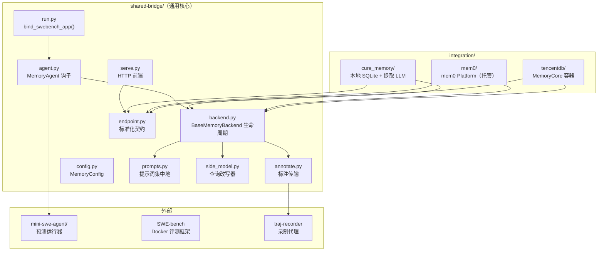
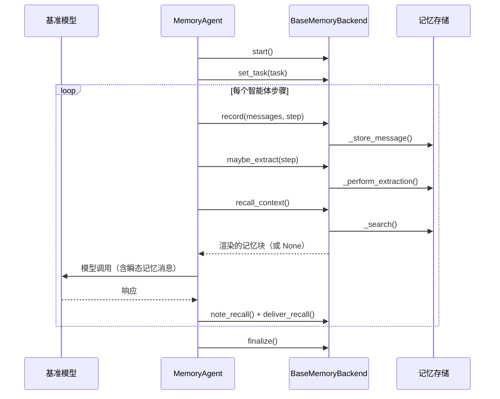

# 架构

memory-bridge 采用分层架构：与具体智能体无关的记忆内核（后端生命周期、端点契约、集成）、当前指向 mini-swe-agent 的薄适配器，以及驱动 A/B 对比的 SWE-bench 评测框架。

## 组件概览



## 目录布局

```text
memory-bridge/
├── shared-bridge/     通用桥接核心（不出现集成名；由测试强制）
│   ├── agent.py       MemoryAgent：将记忆接入智能体循环
│   ├── backend.py     BaseMemoryBackend：生命周期骨架 + 追踪 + 缓存 + 改写
│   ├── side_model.py  固定格式 side-model 调用（查询改写器）
│   ├── prompts.py     提示词集中地：召回策略、提取指引、改写提示
│   ├── config.py      MemoryConfig：所有共享配置键（extra="forbid"）
│   ├── endpoint.py    标准化 add/search/update/delete 契约
│   ├── serve.py       任意 MemoryEndpoint 的标准库 HTTP 前端
│   ├── annotate.py    指向 traj-recorder 代理的标注传输
│   └── run.py         bind_swebench_app()：重绑运行器的智能体类
├── integration/       每个记忆系统一个包，绑定到 shared-bridge
│   ├── cure_memory/   本地 SQLite 存储 + 独立提取 LLM
│   ├── mem0/          mem0 Platform（托管提取，httpx REST 客户端）
│   └── tencentdb/     TencentDB-Agent-Memory（每 run root 一个 MemoryCore 容器）
├── utils/             流水线脚本（setup → predict → merge → evaluate → summarize）
├── mini-swe-agent/    预测运行器检出（保留自己的工具 venv）
└── output/            run root
```

## 共享环境

bundle 使用唯一一个环境：以 bundle 目录为根的 uv 工作空间。


切勿移除 `litellm[proxy]` 依赖——否则首次模型调用会报 `ModuleNotFoundError: No module named 'fastapi'`。


* `shared-bridge` 和三个集成是**可编辑的工作空间成员**
* `mini-swe-agent` 是可编辑的路径依赖，`litellm[proxy]` 是常规依赖；两者都不是工作空间成员
* 集成从不拥有自己的 uv 环境
* 记忆臂与合并/摘要阶段通过 `uv run --project <bundle-root> ...` 执行；基线预测保留 mini-swe-agent 自己的环境（附加 `litellm[proxy]` overlay），评测则通过 SWE-bench 检出的环境执行

## 记忆如何进入 episode

基准模型只能看到标准的 `bash` 工具——没有记忆工具、没有提示词暗示、没有模型子类。记忆在模型调用前以**瞬态**用户消息的形式注入（模型可见，但不持久化到轨迹），并以已录制消息的形式离开 episode，由宿主端后端稍后提取到存储中。



## 查询改写器和检索缓存

两个机制减少浪费并改善召回相关度：


{% column width="50%" %}
### 脏标记检索缓存

仅当新 episode 开始、一次提取 tick 被计数（无论成功或失败——失败的提取也可能已经写入），或召回查询被改写时才执行搜索。干净的步骤复用缓存的载荷，消除冗余的托管搜索调用。

失败的搜索永不被缓存——标记保持设置状态，下一步重试。


{% column width="50%" %}
### 查询改写器

当 `rewrite_every_n_steps > 0` 时，side-model 按配置的频率改写召回查询。改写器接收任务文本和最近的进度（最后 6 条录制消息），返回聚焦的搜索查询（≤300 字符）。

改写调用是失效封闭的：任何错误都保留之前的查询。



## SWE-bench 评测双臂

A/B 对比由在同一有序实例列表上的两次运行组成：

| 臂 | 驱动器 | 记忆 | 轨迹 |
|---|---|---|---|
| **基线** | `utils/run-predictions.sh` | 无 | 与未修改的运行器逐字节一致 |
| **记忆** | `utils/run-memory-arm.sh <integration>` | 启用（`scope=run`） | 带 `memory_*` 事件的标注 |

两个臂写入不同的 run root，由同一 Docker 评测框架打分，因此分数差异可归因于记忆系统本身。

## 伴生检出

| 仓库 | 位置 | 用途 |
|---|---|---|
| [mini-swe-agent](https://github.com/SWE-agent/mini-swe-agent) | `mini-swe-agent/`（仓库内） | 预测运行器；可编辑路径依赖（非工作空间成员） |
| [SWE-bench](https://github.com/SWE-bench/SWE-bench) | 同级或 `SWE-bench/` | 本地 Docker 评测框架 |
| [traj-recorder](https://github.com/ChangranXU/traj-recorder/tree/memory) | `extension/traj-recorder/`（仓库内或上级目录下） | 带 roster lane 和 annotate 端点的录制代理 |
