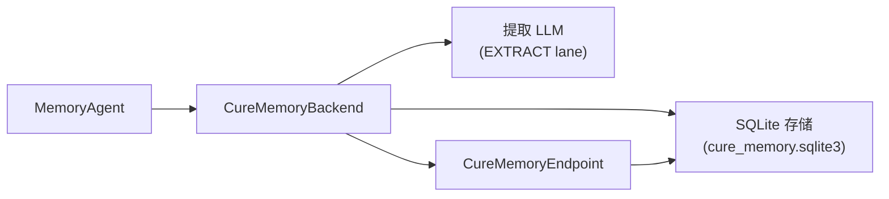

# CURE Memory

CURE 集成（`integration/cure_memory/`）使用本地 SQLite 存储进行记忆持久化，以及专用提取 LLM 将智能体消息转换为结构化记忆。

## 架构

## 组件

| 组件 | 模块 | 用途 |
|---|---|---|
| 后端 | `cure_memory_bridge.backend` | 实现 `BaseMemoryBackend` 生命周期钩子 |
| 智能体 | `cure_memory_bridge.agent` | 将后端绑定到 `MemoryAgent` |
| 端点 | `cure_memory_bridge.endpoint` | `CureMemoryEndpoint` 适配器 |
| 记忆系统 | `cure_memory.*` | 内嵌的 CURE 记忆系统 |

## 配置

除了共享的 `MemoryConfig` 键外，CURE 集成还添加了提取客户端设置——环境变量，每个都有对应的 `agent.memory.extract_*` 配置字段，且配置字段优先于环境变量：

| 环境变量 | 配置字段 | 描述 |
|---|---|---|
| `EXTRACT_MODEL` | `agent.memory.extract_model` | 提取 LLM 的模型名 |
| `EXTRACT_BASE_URL` | `agent.memory.extract_base_url` | 提取 LLM 的 API 端点 |
| `EXTRACT_API_KEY` | `agent.memory.extract_api_key` | 提取 LLM 的 API 密钥 |

记忆臂驱动通过 EXTRACT 代理 lane 按实例接好这三项，因此臂流程的 roster `.env` 一项都不需要设置。


bundle 的 CURE 副本（`integration/cure_memory/src/cure_memory`）是强化后的真实来源——它移除了上游的凭据泄露默认值（硬编码的第三方端点回退和 `extractor.py` 中的 `$OPENAI_API_KEY` 环境变量回退）。**切勿**从上游批量刷新该副本。


## 运行隔离

在 `scope=run` 下，CURE 臂在 run root 中创建共享 SQLite 存储 `runs/mini-swe-agent/cure_memory.sqlite3`。该存储使用两层适用性结构：

* **仓库级记忆**（`scope="project"`）— 仅在同一仓库的 episode 内可检索
* **通用记忆**（`scope="user"`，`project_id=NULL`）— 流向每个 episode

## 代理 lane

| Lane | 角色 | 流量 |
|---|---|---|
| MAIN | 基准模型 | 每次模型调用 |
| EXTRACT | 提取 LLM | 记忆提取决策 |
| QUERY | 查询改写器 | 召回查询改写（启用时） |

## 记忆身份

方案：`cure-sqlite-row-version-v1`

格式：`store_id:semantic_digest`——在 episode 生命周期内稳定，可与后续 episode 的 delivery 连接。

## 提取指引

CURE 后端通过将文本附加到其 `MEMORY_POLICY_PROMPT`（`cure_memory/prompts.py:memory_policy_prompt`）来传达 `extraction_guidelines`。后端上声明了能力标志 `_CONVEYS_EXTRACTION_GUIDELINES = True`。

## 与原生方式的对比

原生状态下，CURE 是一个库：由宿主应用自己调用 `start_session` / `record_message` / `extract_runtime_memories` / `memory_search`，并自行决定何时调用。本集成通过共享后端生命周期驱动同一记忆系统，臂测得的是 CURE 本身——所有动作均沿用原生调用，桥接层的自动化在所有集成间统一施加。

| 记忆动作 | 原生方式 | 本集成 | 对齐？ |
|---|---|---|---|
| 添加 / 提取 | 宿主记录消息并手动调用提取 | 同样的 `record` / `extract` 调用，由后端提取节拍驱动 | ✅ |
| 搜索 / 召回 | 宿主调用 `memory_search` 并自行放置上下文 | 同一原生搜索，由后端每步执行，受共享注入策略约束 | ✅ |
| 更新 / 删除 | 由提取 LLM 决定取代/删除动作 | 臂内行为相同；端点另外对外暴露 update/delete | ✅ |

三项动作均使用同一原生 CURE 调用。差异仅在自动化层面：提取时机由共享节拍驱动（跨集成一致，保持提取投入可比），召回由共享注入策略约束（分数下限、字符预算）。标准化端点是附加面，不触碰臂的被测行为。
