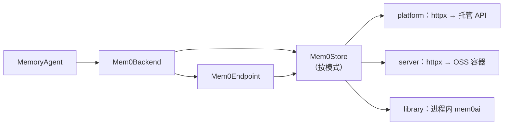

# mem0

mem0 集成（`integration/mem0/`）以三种部署模式之一运行 [mem0](https://mem0.ai)，由 `integration/mem0/configs/memory_defaults.yaml` 中带锚定的 `mode:` 行选择。模式归 yaml 所有：记忆臂驱动器读取同一行（`read_mem0_mode`）并拒绝 `--config agent.memory.mode=` 附加项，因此驱动器与桥接层绝不会产生分歧。

| 模式 | 对接 | 提取运行位置 | 前置条件 |
|---|---|---|---|
| `platform`（默认） | 托管 [mem0 Platform](https://mem0.ai) REST API（httpx） | 平台侧托管 | bundle 根目录 `.env` 中的 `MEM0_API_KEY` |
| `server` | 每 run 一个自托管 OSS server 容器（httpx） | 容器内，直连提供商上游 | Docker 运行中；bundle 根目录 `.env` 中完整的 `EMBEDDING_*` 四元组（失效封闭） |
| `library` | 进程内 `mem0ai` 引擎 | 进程内，直连提供商上游 | 可选依赖组 `mem0-library`；`EMBEDDING_*` 四元组 |

任何模式下提取流量都不记录进轨迹——MEMORY 代理 lane 始终是零模型调用的标注命名空间。

## 架构

## 组件

| 组件 | 模块 | 用途 |
|---|---|---|
| store 层 | `mem0_bridge.stores` | `Mem0Store` 协议 + `open_store(mode, settings)` 工厂（按模式惰性导入）；每模式一个 store（`platform.py`、`server.py`、`library.py`），由后端与端点共同消费 |
| Platform REST 客户端 | `mem0_bridge.client` | 基于 httpx 的托管 API 客户端（v3 负责 add/search/get-all；v1 负责单条记忆 CRUD、ping 与事件轮询）——由 platform store 包装 |
| 后端 | `mem0_bridge.backend` | 实现 `BaseMemoryBackend` 生命周期钩子 |
| 智能体 | `mem0_bridge.agent` | 将后端绑定到 `MemoryAgent` |
| 端点 | `mem0_bridge.endpoint` | `Mem0Endpoint` 适配器 |

## server 模式

驱动器为每个 run root 在同一桥接网络上管理两个容器：`pgvector/pgvector:pg17`（不发布端口）加上运行时从 vendored 克隆（`integration/mem0/vendor/mem0/`，路由 pin `fdfb763`）构建的 API server（引擎 pin 为 `mem0ai==2.0.19`）。API 发布在 `127.0.0.1:8890`——机器级单臂占用令并发的 server 臂响亮失败。存储位于 `<run-root>/mem0-server/` 下的 run-root 卷；容器与网络在退出时移除。

臂开始前有两道失效即终止的防线：驱动器预创建 `memories` 表（`vector($EMBEDDING_DIMENSIONS)`——server 的默认配置没有维度通道，其即时建集合会按 1536 默认值创建集合，而维度不匹配会让 add 返回 ADD 回执却什么都不持久化），然后运行金丝雀自检（在临时用户 ID 下逐字 add + search + delete）。

## library 模式

引擎在桥接进程内运行（`from mem0 import Memory`），存储经 `agent.memory.run_root` 位于 `<run-root>/mem0/`（qdrant + history db）。`mem0ai` SDK 只能通过可选依赖组 `mem0-library` 进入共享环境——每次 library 模式的实例调用都携带 `uv run --group mem0-library`；裸 `uv sync` 会将其移除。此模式忽略 `search_timeout`（进程内；共享立场只对网络调用设界）。

## 配置

| 变量 | 位置 | 描述 |
|---|---|---|
| `MEM0_API_KEY` | bundle 根目录 `.env` | Platform API 密钥（仅 platform 模式） |
| `EMBEDDING_MODEL` / `EMBEDDING_API_KEY` / `EMBEDDING_BASE_URL` / `EMBEDDING_DIMENSIONS` | bundle 根目录 `.env` | embedding 四元组——在 server/library 模式下必需（失效封闭）：OSS 引擎在每次 add 和 search 都要做嵌入，没有纯词法回退。platform 模式不使用。 |

## 运行隔离

运行隔离来自从带时间戳的 run-root 名称生成的**每次运行的用户 ID**。一次运行的所有记忆都作用域到此用户 ID；server/library 模式在此之上叠加全新的每 run 存储。

## 代理 lane

| Lane | 角色 | 流量 |
|---|---|---|
| MAIN | 基准模型 | 每次模型调用 |
| MEMORY | 标注命名空间 | 零模型调用——桥接层从引擎回执发送记忆协议事件 |
| QUERY | 查询改写器 | 召回查询改写（启用时） |

## 记忆身份

mem0 集成使用引擎自身的记忆 ID，跨 `UPDATE` 版本保持稳定。追踪身份方案记录模式（`mem0-<mode>-memory-v1`）。

## 提取指引

mem0 后端将 `extraction_guidelines` 作为 add 调用的建议性指令传达——平台上为 `custom_instructions`，OSS 表面为 `prompt`（已验证落入同一建议槽位）。后端上声明了能力标志 `_CONVEYS_EXTRACTION_GUIDELINES = True`。

## Platform API 映射

platform 模式的表面：

| 端点动作 | mem0 Platform API |
|---|---|
| 添加 | `POST /v3/memories/add/`，携带消息载荷（异步——客户端轮询 `GET /v1/event/{id}/` 直至添加持久化） |
| 搜索 | `POST /v3/memories/search/`，携带 `query` + `filters.user_id`（及 `top_k`、`threshold`） |
| 更新 | `PUT /v1/memories/{id}/`，携带 `{text, metadata}` |
| 删除 | `DELETE /v1/memories/{id}/` |

## 作用域限制


mem0 在任何模式下都没有桥接端作用域——不存在 CURE 两层仓库/通用适用性结构的等价物。所有记忆都是用户级的。通过元数据过滤实现可选的每仓库作用域是未来路线图项目。


## 与原生方式的对比

原生用法是通过 `mem0ai` SDK 的 `MemoryClient`（`add` / `search` / `update` / `delete`）调用托管 API。在 platform 模式下，本集成以裸 REST 对同一平台执行同样的四个动作，臂测得的是平台本身。（library 模式直接运行原生 `mem0ai` 引擎；下表描述的是 platform 模式。）

| 记忆动作 | 原生方式 | 本集成 | 对齐？ |
|---|---|---|---|
| 添加 | SDK `add(...)`（异步，调用方可轮询） | 同一 v3 add；客户端轮询至持久化 | ✅ |
| 提取 | 平台侧托管（`infer=true`） | 同一托管提取；指引经 `custom_instructions` 传达 | ✅ |
| 搜索 | SDK `search(query, filters=...)`，服务端默认阈值 | 同一 v3 搜索；`threshold` 始终显式发送 | ✅ |
| 更新 / 删除 | SDK v1 `update` / `delete` | 同一 v1 调用，一一对应 | ✅ |

四项动作均命中与原生 SDK 相同的平台端点。两个旋钮被显式固定而非依赖服务端默认值：

- **添加归属**：契约要求持久化后才算成功，且 assistant 事实归属 `user_id`（而非 `agent_id`），使按 user 过滤的搜索能找到它们。
- **搜索阈值**：`threshold` 始终显式发送，因为服务端默认值随 API 版本漂移（可能出现静默的相关性截断）。重排序、图记忆、v2 过滤算子一律不用，以确保臂与端点共享唯一一套检索语义。

端点侧更新/删除时的 `user_id` 归属校验仅在端点运行，臂内从不执行。
