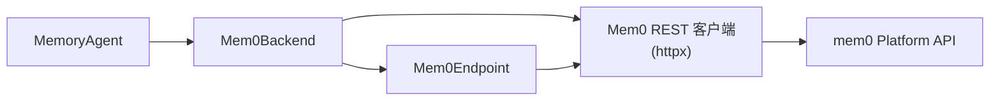

# mem0 Platform

mem0 集成（`integration/mem0/`）使用 [mem0 Platform](https://mem0.ai) 进行托管记忆存储与提取，通过 `httpx` 直接调用其 REST API。

## 架构

## 组件

| 组件 | 模块 | 用途 |
|---|---|---|
| REST 客户端 | `mem0_bridge.client` | 基于 httpx 的 mem0 Platform API 客户端（v3 负责 add/search/get-all；v1 负责单条记忆 CRUD、ping 与事件轮询） |
| 后端 | `mem0_bridge.backend` | 实现 `BaseMemoryBackend` 生命周期钩子 |
| 智能体 | `mem0_bridge.agent` | 将后端绑定到 `MemoryAgent` |
| 端点 | `mem0_bridge.endpoint` | `Mem0Endpoint` 适配器 |

## 配置

| 变量 | 位置 | 描述 |
|---|---|---|
| `MEM0_API_KEY` | `integration/mem0/.env` | Platform API 密钥（必需） |

## 运行隔离

运行隔离来自从带时间戳的 run-root 名称生成的**每次运行的用户 ID**。一次运行的所有记忆在平台上都作用域到此用户 ID。

## 代理 lane

| Lane | 角色 | 流量 |
|---|---|---|
| MAIN | 基准模型 | 每次模型调用 |
| MEMORY | 标注命名空间 | 零模型调用——桥接层从平台回执发送记忆协议事件 |
| QUERY | 查询改写器 | 召回查询改写（启用时） |

## 记忆身份

mem0 集成使用平台自身的记忆 ID，跨 `UPDATE` 版本保持稳定。

## 提取指引

mem0 后端通过 add 端点的建议性每请求 `custom_instructions` 传达 `extraction_guidelines`。后端上声明了能力标志 `_CONVEYS_EXTRACTION_GUIDELINES = True`。

## Platform API 映射

| 端点动作 | mem0 Platform API |
|---|---|
| 添加 | `POST /v3/memories/add/`，携带消息载荷（异步——客户端轮询 `GET /v1/event/{id}/` 直至添加持久化） |
| 搜索 | `POST /v3/memories/search/`，携带 `query` + `filters.user_id`（及 `top_k`、`threshold`） |
| 更新 | `PUT /v1/memories/{id}/`，携带 `{text, metadata}` |
| 删除 | `DELETE /v1/memories/{id}/` |

## 作用域限制


托管平台没有桥接端作用域——不存在 CURE 两层仓库/通用适用性结构的等价物。所有记忆都是用户级的。通过元数据过滤实现可选的每仓库作用域是未来路线图项目。


## 与原生方式的对比

原生用法是通过 `mem0ai` SDK 的 `MemoryClient`（`add` / `search` / `update` / `delete`）调用托管 API。本集成以裸 REST 对同一平台执行同样的四个动作，臂测得的是平台本身。

| 记忆动作 | 原生方式 | 本集成 | 对齐？ |
|---|---|---|---|
| 添加 | SDK `add(...)`（异步，调用方可轮询） | 同一 v3 add；客户端轮询至持久化 | ✅ |
| 提取 | 平台侧托管（`infer=true`） | 同一托管提取；指引经 `custom_instructions` 传达 | ✅ |
| 搜索 | SDK `search(query, filters=...)`，服务端默认阈值 | 同一 v3 搜索；`threshold` 始终显式发送 | ✅ |
| 更新 / 删除 | SDK v1 `update` / `delete` | 同一 v1 调用，一一对应 | ✅ |

四项动作均命中与原生 SDK 相同的平台端点。两个旋钮被显式固定而非依赖服务端默认值：

- **添加归属**：契约要求持久化后才算成功，且 assistant 事实归属 `user_id`（而非 `agent_id`），使按 user 过滤的搜索能找到它们。
- **搜索阈值**：`threshold` 始终显式发送，因为服务端默认值随 API 版本漂移（可能出现静默的相关性截断）。重排序、图记忆、v2 过滤算子一律不用，以确保臂与端点共享唯一一套检索语义。

端点侧更新/删除时的 `user_id` 归属校验仅在端点运行，臂内从不执行。
