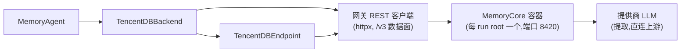

# TencentDB Agent Memory

tencentdb 集成（`integration/tencentdb/`）将 [TencentDB-Agent-Memory](https://github.com/TencentCloud/TencentDB-Agent-Memory) 的独立 **MemoryCore** 网关作为每个 run root 一个 Docker 容器运行（SQLite + FTS5；除 OpenAI 兼容的提取 LLM 外零外部服务）。桥接层通过 `httpx` 直连其 REST API。

## 架构

## 组件

| 组件 | 模块 | 用途 |
|---|---|---|
| REST 客户端 | `tencentdb_bridge.client` | `/v3` 数据面的 httpx 客户端（外加唯一的 `/v2/pipeline/status` 排空轮询） |
| 后端 | `tencentdb_bridge.backend` | 实现 `BaseMemoryBackend` 生命周期钩子；分层召回面（L1 事实、L3 画像、L2 索引）外加按需 L0 对话搜索指南 |
| 智能体 | `tencentdb_bridge.agent` | 将后端绑定到 `MemoryAgent` |
| 端点 | `tencentdb_bridge.endpoint` | `TencentDBEndpoint` 适配器 |

## 部署

每个 run root 一个容器，由 `run-memory-arm.sh tencentdb` 驱动管理：在
`<run-root>/tdai/tdai-gateway.yaml` 生成不含凭据的网关配置（机密由
`docker run -e` 环境插值），数据卷在 `<run-root>/tdai/data`，端口仅发布在
`127.0.0.1:8420`。拆除就是一条 `docker rm -f`。

固定镜像为 `agentmemory/memory-core:1.0.1-beta.1`。上游克隆（`src/TencentDB-Agent-Memory/`，已 gitignore）
是 API 参考与兜底构建锚点。

可选的向量（embedding）lane 需要 roster `.env` 中**全部四项**——
`EMBEDDING_MODEL`、`EMBEDDING_API_KEY`、`EMBEDDING_BASE_URL`、
`EMBEDDING_DIMENSIONS`——要么全设，要么全不设（仅 BM25）。上游对不完整
配置会静默禁用，因此驱动遇到部分配置会立刻报错。

## 运行隔离

运行隔离 = 每次运行的 `user_id`（由 run-root 名铸造）**加上**每次运行全新的
数据卷。仓库定界走原生 `task_id` 维度：L1 召回跨 session 但按仓库过滤
（仓库层），而 L2 场景文件与 L3 用户画像在 team+agent 级累积（通用层）—
即上游的两层设计。

## 代理 lane

| Lane | 角色 | 流量 |
|---|---|---|
| MAIN | 基准模型 | 每次模型调用 |
| MEMORY | 标注命名空间 | 零模型调用——桥接层从水位解析的 API 回执发布记忆协议事件 |
| QUERY | 查询改写器 | 召回查询改写（启用时） |

## 召回面（三个注入层 + 按需搜索）

| 层 | 来源 | 作用域 | 是否注入？ |
|---|---|---|---|
| L1 原子记忆 | `atomic/search` | 仓库级（`task_id`） | 是——带分数、带下限、切片 |
| L3 用户画像 | `core/read` | team+agent | 是——前插、豁免预算 |
| L2 场景索引 | `scenario/ls` | team+agent | 是——头部小节含 `curl` 指南 |
| L0 对话搜索 | `conversation/search` | 仓库级、跨 session | 否——智能体经 `curl` 指南主动发起 |

1. **L1 原子记忆**——带分数的 `atomic/search` 命中，经 `task_id` 按仓库定界，由共享基座做分数下限与切片。
2. **L3 用户画像**——来自 `core/read` 的无分数伪命中，**前插**使基座的按序切片在 L1 命中占满预算时仍保留它。它是本臂唯一豁免预算的层：完整无界渲染（原生对齐），不占用 `max_total_recall_chars`。
3. **L2 场景索引**——来自 `scenario/ls` 的头部小节（路径 + 摘要），带自包含的 `curl` 指南；智能体按需读取完整场景文件（由后端观测为智能体主动读取，每次消耗一步）。条目按热度降序渲染并展示每个场景的热度与更新时间，由后端从用户画像的场景导航尾段解析。`scenario/ls` 仍是存在性来源；无导航信息的条目按 ls 顺序殿后；无本地截断（仅受上游 `maxScenes` 合并纪律约束）。
4. **L0 对话搜索（按需，从不注入）**——召回头部携带自包含的 `curl | jq | tee -a` 指南调用 `conversation/search`（查询形态与 L1 相同，仓库层 `task_id` 烘焙在内，设计上跨 session，每次调用返回 `conversation_search_limit` 条）。jq 管道将响应渲染为与原生 openclaw 插件工具输出几乎逐字节一致，并把每次搜索追加到 episode 本地的 `/tmp/tdai-l0-searches.md`，后续步骤重读该文件而非重复搜索。每次搜索消耗智能体一步，以观测而非中介的方式计数（`agent_conversation_searches` / `conversation_search_chars`）。指南随每次注入召回到达模型——复刻原生行为中该工具始终注册的设计。

## 提取

提取在服务端运行（按阈值分批：预热 1→2→4→之后每 5 个 user 轮次；30 秒
的 L1 idle 计时器兜住低于阈值的尾部）。桥接层将缓冲消息分块
`conversation/add` 发送，在专用预算内排空 `l1.idle`，并通过时间戳水位
查询解析产出的 id。finalize 排空具备 idle 计时器感知，使 episode 尾部在下一个
实例开始前落库。

提取 LLM 流量直连提供商上游（不记录进轨迹——与 mem0 各模式下不走轨迹的提取同等待遇）。
推理混合模型需要足够大的 `maxTokens`，否则思考会耗尽整个预算（驱动固定
32k/300 秒，高于上游独立（standalone）模式的出厂默认值 4096/120 秒）。

## 端点映射

| 端点动作 | 网关 API |
|---|---|
| Add | 分块 `POST /v3/conversation/add`（每次 add 新 session）+ 超过一个周期（>10 条消息）的 add 走 idle 计时器感知的 L1 排空 + 水位查询；`infer=false` → 400（不存在逐字插入）；user/assistant 之外的角色 → 400；无 user 轮次的 add → 400（永远无法提取） |
| Search | `POST /v3/atomic/search`（用户级——不带 `task_id`） |
| Update | `POST /v3/atomic/update` 按 id 一对一；任何带 metadata 的 update → 400（L1 行不携带 metadata） |
| Delete | `POST /v3/atomic/delete` 单元素批；`deleted_count == 0` → 404 |

## 已知限制


`memories_deleted` 不计数（去重的被取代 id 删除对水位查询不可见——汇总表打印 "-"）。去重合并后的溯源指向**最早**的贡献 episode（`created_at` = 合并并集的最小值）。L1 仓库层是按 episode 而非按记忆的：真正通用的 L1 经验不会跨仓库——跨范围迁移依托 L2/L3 的 team+agent 累积。


## 与原生方式的对比

原生状态下，智能体通过 openclaw 插件或官方 SDK 使用 TencentDB-Agent-Memory。本集成对同一网关的 `/v3` REST 数据面执行同样的记忆动作，臂测得的是该原生系统本身而非重新实现。

| 记忆动作 | 原生方式 | 本集成 | 对齐？ |
|---|---|---|---|
| 捕获（添加） | 插件 `agent_end` 钩子 → `addConversation` | 同一 `/v3/conversation/add`，分块推送 | ⚠️ 触发 |
| 提取 | 服务端异步流水线（默认：4096 tokens / 120 秒） | 同一服务端流水线；限额提高到 32k / 300 秒 | ✅ |
| 注入召回 | 插件钩子：并行 `searchAtomic` + `readCore` + `listScenarios` | 同一三层构成（L1 + L3 + L2），由后端注入 | ✅ |
| 按需搜索 | 注册工具（`tdai_memory_search`、`tdai_conversation_search`、场景读取） | 自包含 `curl` 指南，由智能体作为 shell 步骤执行 | ⚠️ 送达 |
| 更新 / 删除 | SDK 原子更新/删除，外加场景/核心写入 | 端点一一映射到 `/v3/atomic/update` / `delete` | ✅ |

两项偏离均由 mini-swe-agent 的纯 bash 智能体形态（无插件 API、无工具注册）所迫，仅影响送达方式而非底层记忆操作：

- **捕获触发**：mini-swe-agent 没有 `agent_end` 插件钩子。写入的是同一网关端点；后端分块推送消息并经水位查询解析产出 id 用于 `memory.json` 计数。
- **按需搜索送达**：智能体收到自包含 `curl` 指南作为 shell 步骤执行，而非注册工具调用。模型看到与原生工具近乎逐字一致的输出，且每次搜索仍消耗真实、可度量的一步。

提取限额上调（32k tokens / 300 秒，配 30 秒 idle 排空）仅为容量扩展——确保长 episode 完整提取、尾部在下一实例前落库。臂内 L1 以上的被测面保持只读。
