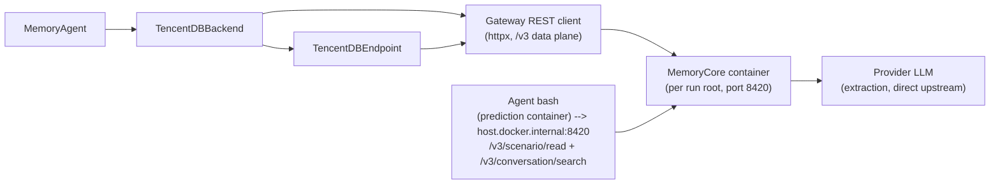

# tencentdb integration (TencentDB-Agent-Memory / MemoryCore)

Binds the standalone **MemoryCore** gateway of
[TencentDB-Agent-Memory](https://github.com/TencentCloud/TencentDB-Agent-Memory)
to the shared memory bridge: one Docker container per run root (SQLite +
FTS5, zero external services besides an OpenAI-compatible extraction LLM),
server-side threshold-batched extraction, and a recall surface of three
injected layers (L1 atomic facts repo-scoped, L3 persona, L2 scenario
index) plus an on-demand L0 conversation search the agent runs itself.

The bridge talks to the gateway's REST API directly over `httpx` — never the
vendored Python SDK. MemoryProxy / MemoryPanel / MemoryKnowledge are not
used; the vendored upstream clone under `src/TencentDB-Agent-Memory/` is a
gitignored development-time API reference and fallback-build anchor (see
[VENDORING.md](VENDORING.md)).

## Architecture



## Running

```bash
./utils/setup-run.sh <ids-file> <name>
./utils/run-memory-arm.sh tencentdb
```

The driver writes the credential-free gateway config
(`<run-root>/tdai/tdai-gateway.yaml` — `${TDAI_*}` leaves interpolate from
`docker run -e` env), starts `agentmemory/memory-core:1.0.1-beta.1` on
`127.0.0.1:8420` with the data volume at `<run-root>/tdai/data`, waits for
`/health`, and removes the container on exit. Port 8420 is a per-machine
single-arm lock (two tencentdb run roots cannot run concurrently).

The embedding lane is optional: set **all four** of `EMBEDDING_MODEL`,
`EMBEDDING_API_KEY`, `EMBEDDING_BASE_URL`, `EMBEDDING_DIMENSIONS` in the
roster `.env` to enable the vector lane (`provider: "openai"`), or none for
BM25-only. A partial set is silently disabled upstream, so the driver
refuses it loudly.

## Isolation

| Field | Value | Tier |
|---|---|---|
| `team_id` | `minisweagent` | fixed |
| `agent_id` | `memory-bridge` | fixed |
| `user_id` | `minisweagent-tdai-<runroot>` | run isolation |
| `task_id` | episode's repo key | L1 repo tier |
| `session_id` | `<instance>-<uuid4hex>` | per episode |

L1 (`atomic/search`) is cross-session but task-filtered — repo-scoped recall
within the run. L2/L3 profiles accumulate at team+agent level — the general
tier (upstream's own two-tier design).

## Config reference (`agent.memory.*` overlay)

| Key | Default | Purpose |
|---|---|---|
| `endpoint` | `http://127.0.0.1:8420` | gateway base URL |
| `service_id` | `default` | `x-tdai-service-id` (pipeline instance bucket) |
| `run_root` | (driver-filled) | anchors `<run-root>/tdai/episodes.jsonl` |
| `drain_budget` | `300` (overlay) | per-tick L1 idle drain budget (s) |
| `add_timeout` | `600` (overlay) | `conversation/add` client timeout (s) — the gateway embeds every L0 message sequentially inside the add |
| `finalize_drain_budget` | `600` (overlay) | finalize drain budget (two serial L1 cycles + idle wait) |
| `drain_interval` | `1.0` | drain poll interval (s) |
| `conversation_search_limit` | `5` | hits per agent-run conversation search (the native tool's and the wire schema's default; the route caps 1..100) |
| `search_timeout` | `30` (overlay) | search-call ceiling — the query embed rides the call when the vector lane is on |
| `recall_min_score` | unset | never set — RRF scores are tiny |
| `max_total_recall_chars` | `2000` | total host-side render budget over the L1 memory lines (0 = off) — the persona pseudo-hit is budget-exempt |
| `max_chars_per_memory` | `0` | per-line render cap, off (the native default) |

There is no `l1_idle_timeout` config key: the backend resolves the effective
L1 idle timeout from the driver-generated `<run-root>/tdai/tdai-gateway.yaml`
at start (the single source of truth) and records it in the settings artifact
with `l1_idle_timeout_source: "gateway-yaml"`.

## Interpreting memory.json

Same core checkpoints as the other arms (`enabled/available: true`,
`extraction_errors: 0`, `recall_injections > 0` on the second same-repo
instance). Integration specifics:

- `memories_added` / `memories_updated` — the watermark rows' `version`
  split (0 = create, ≥1 = rewrite). `memories_deleted` stays un-counted
  (dedup's superseded-id deletions are invisible) — the summarizer prints
  "-".
- `agent_scene_reads` / `scene_read_chars` — agent-initiated L2 reads
  observed from the trajectory (each costs the agent one step).
- `agent_conversation_searches` / `conversation_search_chars` —
  agent-initiated L0 conversation searches observed from the trajectory
  (each costs the agent one step; the accumulating
  `/tmp/tdai-l0-searches.md` file is container-local, per episode).
- Settings record the pinned gateway config (promptMode, drain budgets,
  embedding mode, bm25 language, isolation ids) plus the idle timeout
  resolved from the generated yaml — no credentials.
- Provenance: hits carry `(from this episode)` / `(from earlier episode
  <instance>)` / `(from an earlier episode)` suffixes; the `"unknown"`
  sentinel origin is counted as cross-episode ("not this episode"). After a
  dedup merge, `created_at` points at the **oldest** contributing episode
  (documented merge bias).

## Tests

```bash
uv run python -m pytest integration/tencentdb/tests -q   # from the bundle root
```

Offline only: wire tests over `httpx.MockTransport`, backend/endpoint/agent
tests over the scripted `FakeGatewayClient` (`_make_client` seam), trace
tests over the shared `CaptureServer`. The tests dir is a `tencentdb.tests`
package so its module names never collide with the sibling suites under
pytest prepend import mode.

Deeper working notes: [AGENTS.md](AGENTS.md).
