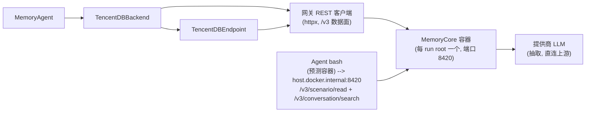

# tencentdb 集成（TencentDB-Agent-Memory / MemoryCore）

将 [TencentDB-Agent-Memory](https://github.com/TencentCloud/TencentDB-Agent-Memory)
的独立 **MemoryCore** 网关接入共享 memory bridge：每个 run root 一个
Docker 容器（SQLite + FTS5，除 OpenAI 兼容的抽取 LLM 外零外部服务）、
服务端按阈值分批的抽取流水线、三层注入式召回面（L1 按仓库定界的原子
事实、L3 用户画像、L2 场景文件索引），外加由 agent 自行发起的按需
L0 对话搜索。

bridge 通过 `httpx` 直连网关的 REST API — 从不使用上游 Python SDK。
MemoryProxy / MemoryPanel / MemoryKnowledge 均不使用；
`src/TencentDB-Agent-Memory/` 下的上游克隆是 gitignore 的开发期 API 参考
与兜底构建锚点（见 [VENDORING.md](VENDORING.md)）。

## 架构



## 运行

```bash
./utils/setup-run.sh <ids-file> <name>
./utils/run-memory-arm.sh tencentdb
```

驱动生成不含凭据的网关配置（`<run-root>/tdai/tdai-gateway.yaml` —
`${TDAI_*}` 叶子由 `docker run -e` 环境插值），在 `127.0.0.1:8420` 启动
`agentmemory/memory-core:1.0.1-beta.1`（数据卷在
`<run-root>/tdai/data`），等待 `/health`，退出时移除容器。端口 8420 是
单机单 arm 锁（两个 tencentdb run root 不能并发）。

向量（embedding）通道可选：在 roster `.env` 中**全部四项**
`EMBEDDING_MODEL`、`EMBEDDING_API_KEY`、`EMBEDDING_BASE_URL`、
`EMBEDDING_DIMENSIONS` 都设置才启用（`provider: "openai"`），否则仅
BM25。上游对不完整的配置会*静默禁用*，因此驱动遇到部分配置会立刻报错。

## 隔离

| 字段 | 值 | 层级 |
|---|---|---|
| `team_id` | `minisweagent` | 固定 |
| `agent_id` | `memory-bridge` | 固定 |
| `user_id` | `minisweagent-tdai-<runroot>` | run 隔离 |
| `task_id` | 当集仓库键 | L1 仓库层 |
| `session_id` | `<instance>-<uuid4hex>` | 每集 |

L1（`atomic/search`）跨 session 但按 task 过滤 — run 内按仓库定界的召回。
L2/L3 画像在 team+agent 级累积 — 通用层（上游自身的两层设计）。

## 配置参考（`agent.memory.*` 覆盖）

| 键 | 默认值 | 用途 |
|---|---|---|
| `endpoint` | `http://127.0.0.1:8420` | 网关基址 |
| `service_id` | `default` | `x-tdai-service-id`（流水线实例桶） |
| `run_root` | （驱动填入） | 锚定 `<run-root>/tdai/episodes.jsonl` |
| `drain_budget` | `300`（overlay） | 每次抽取 tick 的 L1 idle 排空预算（秒） |
| `add_timeout` | `600`（overlay） | `conversation/add` 客户端超时（秒）— 网关在 add 内逐条嵌入 L0 消息 |
| `finalize_drain_budget` | `600`（overlay） | finalize 排空预算（两个串行 L1 周期 + idle 等待） |
| `drain_interval` | `1.0` | 排空轮询间隔（秒） |
| `conversation_search_limit` | `5` | agent 对话搜索每次返回的命中数（原生工具与线路模式的默认值；路由上限 1..100） |
| `search_timeout` | `30`（overlay） | 搜索调用上限 — 向量通道开启时查询嵌入占用该调用 |
| `recall_min_score` | 未设置 | 永不设置 — RRF 分数极小 |
| `max_total_recall_chars` | `2000` | L1 记忆行的宿主机渲染总预算（0 = 关闭）— 用户画像伪命中豁免预算 |
| `max_chars_per_memory` | `0` | 单行渲染上限，关闭（原生默认值） |

没有 `l1_idle_timeout` 配置键：后端在启动时从驱动生成的
`<run-root>/tdai/tdai-gateway.yaml` 解析生效的 L1 idle 超时（单一事实来源），
并以 `l1_idle_timeout_source: "gateway-yaml"` 记录进 settings 产物。

## 解读 memory.json

核心检查点与其他 arm 相同（`enabled/available: true`、
`extraction_errors: 0`、第二个同仓库实例 `recall_injections > 0`）。
本集成特有：

- `memories_added` / `memories_updated` — 水位行 `version` 拆分
  （0 = 新建，≥1 = 重写）。`memories_deleted` 不计数（去重删除对水位
  查询不可见）— 汇总表打印 "-"。
- `agent_scene_reads` / `scene_read_chars` — 从轨迹观测到的 agent 主动
  L2 读取（每次消耗 agent 一步）。
- `agent_conversation_searches` / `conversation_search_chars` — 从轨迹
  观测到的 agent 主动 L0 对话搜索（每次消耗 agent 一步；累积文件
  `/tmp/tdai-l0-searches.md` 为容器本地、每集一份）。
- settings 记录固定的网关配置（promptMode、排空预算、
  embedding 模式、bm25 语言、隔离 id）以及从生成的 yaml 解析出的 idle
  超时 — 不含凭据。
- 溯源：命中行带 `(from this episode)` / `(from earlier episode
  <instance>)` / `(from an earlier episode)` 后缀；`"unknown"` 哨兵
  origin 计为跨集（含义是“非本集”）。去重合并后 `created_at` 指向
  **最早**的贡献集（已记录的合并偏置）。

## 测试

```bash
uv run python -m pytest integration/tencentdb/tests -q   # bundle 根目录执行
```

仅离线：线路测试走 `httpx.MockTransport`，backend/endpoint/agent 测试走
脚本化的 `FakeGatewayClient`（`_make_client` 缝隙），trace 测试走共享
`CaptureServer`。tests 目录是 `tencentdb.tests` 包，模块名不会与兄弟
套件在 pytest prepend 导入模式下冲突。

更多工作笔记见 [AGENTS.md](AGENTS.md)。
